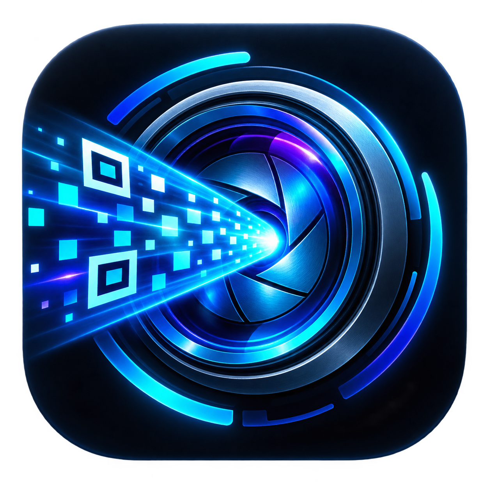

# LumaDrop Optical

<p align="center">
  
</p>

LumaDrop transfers files directly from one screen to another phone's camera using animated, fountain-coded QR frames. It needs no account, pairing, Bluetooth, internet connection, or shared Wi-Fi network.

This project packages a modified version of [Decimen Optical Transfer](https://github.com/bashalarmistalt/decimen-optical-transfer) as a fully offline Android application and adds an Android-focused interface and integrations.

## Highlights

- Send any file type up to 64 MB.
- Select multiple files and transfer them together as a standards-compatible ZIP archive.
- Share files from another Android app directly into LumaDrop.
- Recover from missed or duplicate QR frames using fountain coding.
- Receive through the rear or front camera.
- Zoom from 1x to 10x with a slider, pinch gesture, or mouse wheel.
- Automatically maximize sender brightness during transmission and restore it afterward.
- Save received files through Android's native document picker.
- Run entirely from bundled app assets after installation.
- Transfer text snippets as well as files.

Transfer speed depends heavily on the sender display, camera exposure, focus, QR density, and device performance. A target frame rate is not a guaranteed throughput figure.

## Install

Download the newest APK from [GitHub Releases](https://github.com/Aboody2013H/lumadrop-optical/releases). Android may ask you to allow installation from your browser or file manager.

The current downloadable artifact is release-signed for direct sideloading. Android 6.0/API 23 or newer is required. Archived development builds remain debug-signed.

If an older debug-signed LumaDrop build is already installed, Android may require it to be uninstalled before installing the release-signed build because the signing certificates are different.

All ten development APKs—from the original native prototype through `0.5.2-luma.9`—are preserved on the Releases page. See the [changelog](CHANGELOG.md) for the feature added in each build and known historical limitations.

## Build from source

Requirements:

- Node.js 24 or newer
- JDK 17
- Android SDK 36

Build and test the web application:

```bash
cd decimen-web
npm install
npm test
npm run build
```

Copy the contents of `decimen-web/dist/` into `decimenApp/src/main/assets/web/` when web application code changes, then build the Android wrapper from the repository root:

```bash
./gradlew :decimenApp:lintDebug :decimenApp:assembleDebug
```

The APK is written to `decimenApp/build/outputs/apk/debug/decimenApp-debug.apk`.

## Project layout

- `decimen-web/` — modified Decimen web application and optical protocol tests.
- `decimenApp/` — primary offline Android WebView wrapper and native bridges.
- `app/` — earlier native Kotlin/Compose LumaDrop prototype retained for reference.
- `branding/` — LumaDrop artwork and icon master.
- `releases/` — checksum metadata; APK binaries are published through GitHub Releases.

## Privacy and security

File processing and optical encoding happen locally. The receiver needs camera permission. LumaDrop does not require an account or a server for transfers. As with any file-transfer tool, only open received files when you trust the sender.

## Origin and license

LumaDrop is a modified distribution of Decimen Optical Transfer by Evan Crawley (Bash Alarmist). Decimen and the LumaDrop modifications are distributed under the GNU Affero General Public License v3.0 or later. Original copyright, contribution, codec, and third-party notices are retained in [NOTICE.md](NOTICE.md), `decimen-web/NOTICE`, and the vendored codec notice files.

See [LICENSE](LICENSE) and [CHANGELOG.md](CHANGELOG.md).
